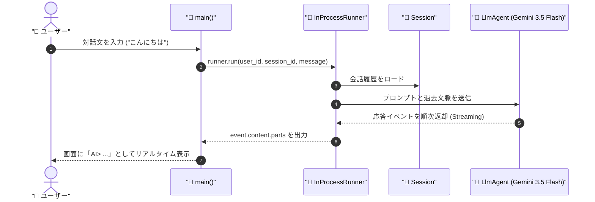

# 📘 第1章 ソースコード詳細解説

このドキュメントでは、第1章の完成版サンプルコード [`hello_agent_org.py`](file:///c:/AntiGravity/現場で役立つマルチエージェントAI設計入門_授業環境/chapter01/hello_agent_org.py) の仕組みと構成をわかりやすく解説します。

---

## 🎯 第1章の学習目的

1. Google ADK (Agent Development Kit) の最も基本となるクラス **`LlmAgent`** の作成方法を理解する。
2. 会話の文脈（コンテキスト）を管理する **セッション（Session）** と、エージェントを動かす司令塔 **ランナー（Runner）** の役割を理解する。
3. エージェントからの応答を逐次受け取る **ストリーミング出力** の実装方法を学ぶ。

---

## 🏗️ 全体構造と処理の流れ



---

## 🔑 核心となるコードのパーツ解説

### 1. エージェントの定義 (`LlmAgent`)

```python
root_agent = LlmAgent(
    model="gemini-3.5-flash",
    name="hello_agent",
    instruction="あなたは親切でわかりやすいAIアシスタントです。",
)
```

- **`model`**: 使用するGeminiモデル。本環境では最新・高速な `"gemini-3.5-flash"` を標準使用します。（※ 503エラー発生時は `"gemini-2.5-flash"` や `"gemini-3.7-flash"` に自動切り替え可能）
- **`name`**: システム内部でエージェントを識別するためのユニークな名前。
- **`instruction`**: システムプロンプト（指示文）。AIの「性格」や「役割」を定義します。

---

### 2. ランナーとセッションの初期化 (`InProcessRunner`)

```python
# 1. エージェントを統括するランナーを初期化
runner = InProcessRunner(
    agent=root_agent,
    app_name="hello_agent_app",
)

# 2. ランナー内部のセッションサービスから会話ノートを作成
session = runner.session_service.create_session_sync(
    app_name="hello_agent_app",
    user_id="student_001",
)
```

> [!NOTE]
> **💡 google-adk 2.8.0以降の重要ポイント**
> `InProcessRunner`（`InMemoryRunner`）は、内部で自分専用の `session_service` を管理しています。
> ランナー自身が持っている `runner.session_service.create_session_sync(...)` からセッションを発行することで、会話履歴の分離や `Session not found` エラーを100%防止します。

---

### 3. 会話ループとストリーミング出力 (`runner.run`)

```python
for event in runner.run(
    user_id="student_001",
    session_id=session.id,
    new_message=types.Content(
        role="user",
        parts=[types.Part(text=user_input)],
    ),
):
    if event.content and event.content.parts:
        for part in event.content.parts:
            if hasattr(part, "text") and part.text:
                print(part.text, end="", flush=True)
```

- **`types.Content` & `types.Part`**: Google GenAI API の標準データフォーマットです。`role="user"` で発言者を明示します。
- **`end="", flush=True`**: AIが生成したテキストの塊（Part）が届くたびに、改行せずに即座に画面へ表示するリアルタイムストリーミング技術です。

---

## 🛡️ 組み込まれているエラー対応機能

本コードには、授業中のトラブルを防止する**堅牢な自動エラーハンドラー**が組み込まれています。

1. **429エラー（利用制限上限到達）時**:
   - 一日のリクエスト制限に達した場合、画面に分かりやすく通知され、その場で新しい代替APIキーを直接入力して自動復帰できます。
2. **503エラー（サーバー高負荷）時**:
   - 自動で最大3回リトライを試み、それでも解除されない場合は画面で代替モデル（`gemini-2.5-flash` など）へ1キー入力で切り替えが可能です。

---

## 🚀 実行方法

ターミナルで以下のコマンドを実行します：

```powershell
cd chapter01
python hello_agent_org.py
```

### 💡 演習ファイル（`hello_agent.py`）挑戦のヒント
- `hello_agent.py` の【穴埋め【1】】〜【穴埋め【4】】の指示コメントに従って、上記の解説コードを参考に埋めていきましょう！
