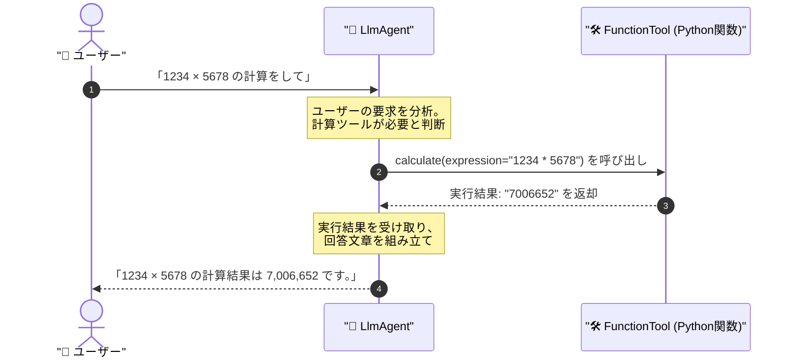

# 📘 第2章 ソースコード詳細解説

このドキュメントでは、第2章の完成版サンプルコード [`basic_agent_org.py`](file:///c:/AntiGravity/現場で役立つマルチエージェントAI設計入門_授業環境/chapter02/basic_agent_org.py) の仕組みと構成をわかりやすく解説します。

---

## 🎯 第2章の学習目的

1. AIエージェントに自作のPython関数（ツール）を使わせる **`FunctionTool`** の仕組みを理解する。
2. AIがユーザーの質問を解析し、どのツールをどの引数で呼び出すかを自律判断する **Tool Call (Function Calling)** の流れを体感する。

---

## 🏗️ 全体構造と処理の流れ



---

## 🔑 核心となるコードのパーツ解説

### 1. ツールの元となるPython関数の定義

```python
def calculate(expression: str) -> str:
    """数式を計算します。例: '2 + 3 * 4'"""
    try:
        # 安全な評価関数で計算
        result = eval(expression, {"__builtins__": {}}, {})
        return f"計算結果: {result}"
    except Exception as e:
        return f"計算エラー: {e}"
```

- **型ヒント (`expression: str`) と Docstring (`"""数式を..."""`) が非常に重要**です。
- LLMは関数名、引数の型、Docstringの説明文を読んで「このツールは何をするものか」「どのような引数を渡すべきか」を自動理解します。

---

### 2. `FunctionTool` によるツールのバインドとエージェント構築

```python
root_agent = LlmAgent(
    model="gemini-3.5-flash",
    name="basic_agent",
    instruction="あなたは役立つAIアシスタントです。計算や天気に関する質問にはツールを使用してください。",
    tools=[
        FunctionTool(func=calculate),
        FunctionTool(func=get_weather),
    ],
)
```

- **`tools=[FunctionTool(func=...)]`**: 定義したPython関数を `FunctionTool` でラップし、`LlmAgent` に手足として持たせます。
- エージェントは必要に応じて `calculate` や `get_weather` を自動で選んで呼び出します。

---

## 🚀 実行方法

ターミナルで以下のコマンドを実行します：

```powershell
cd chapter02
python basic_agent_org.py
```

### 試してみる発言例：
- `1234 × 5678 を計算して` ➔ `calculate` ツールが起動
- `東京の天気を教えて` ➔ `get_weather` ツールが起動

### 💡 演習ファイル（`basic_agent.py`）挑戦のヒント
- `basic_agent.py` では `FunctionTool(func=...)` のバインド部分が穴埋めになっています。上記の書き方を参考にツールを完成させましょう！
