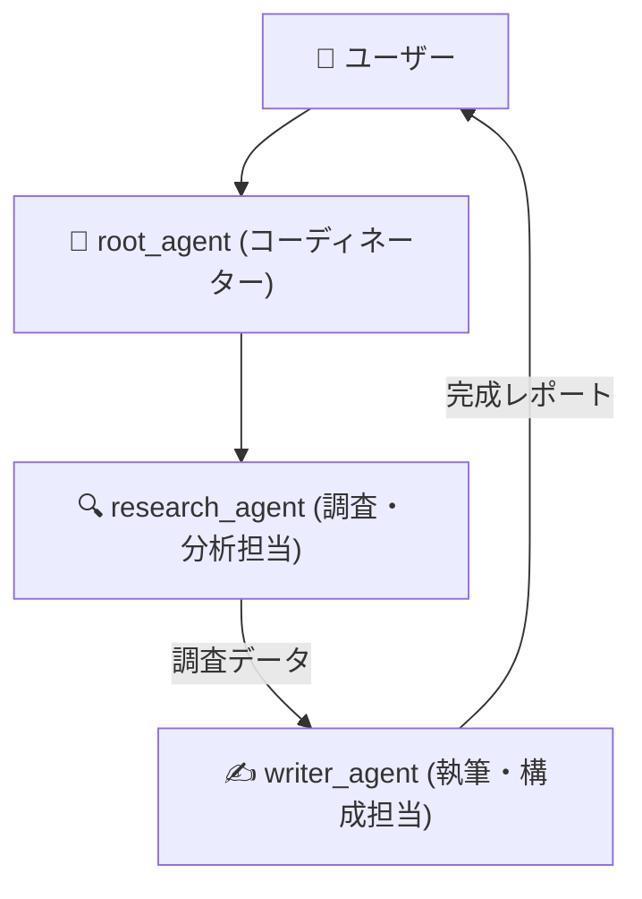

# 📘 第3章 ソースコード詳細解説

このドキュメントでは、第3章の完成版サンプルコード [`context_agent_org.py`](file:///c:/AntiGravity/現場で役立つマルチエージェントAI設計入門_授業環境/chapter03/context_agent_org.py) の仕組みと構成をわかりやすく解説します。

---

## 🎯 第3章の学習目的

1. **Context Engineering（プロンプトエンジニアリング）** の手法を学び、エージェントの出力品質を劇的に高める方法を理解する。
2. 専門の異なる複数のエージェント（調査担当・執筆担当）に役割分担させ、高度なレポートを自動生成する基礎を学ぶ。

---

## 🏗️ 全体構造と役割分担



---

## 🔑 核心となるコードのパーツ解説

### 1. 専門エージェント【1】：調査・分析担当 (`research_agent`)

```python
research_agent = LlmAgent(
    model="gemini-3.5-flash",
    name="research_agent",
    description="テーマに関する事実、メリット・デメリット、将来の展望を網羅的に調査・分析するエージェント",
    instruction="""
    あなたはリサーチアナリストです。
    与えられたテーマについて、以下の観点から客観的な事実とデータを整理してください：
    1. 概要と背景
    2. 主なメリット・導入効果（3点）
    3. 懸念点・リスク・課題（3点）
    """,
)
```

- **`description`**: 親エージェント（root_agent）が「このサブエージェントは何が得意か」を理解するための説明文です。

---

### 2. 専門エージェント【2】：文章執筆担当 (`writer_agent`)

```python
writer_agent = LlmAgent(
    model="gemini-3.5-flash",
    name="writer_agent",
    description="調査結果をもとに、ビジネスパーソン向けの見やすいレポート文章を作成するエージェント",
    instruction="""
    あなたはプロのビジネスライターです。
    調査結果を受け取り、経営陣が短時間で理解できる見やすいレポートを作成してください。
    - 構成: タイトル、要約、詳細分析、今後のアクション提案
    - 見出しと箇条書きを活用し、専門用語には補足をつけてください。
    """,
)
```

---

### 3. 指揮官エージェント (`root_agent` の `sub_agents` 設定)

```python
root_agent = LlmAgent(
    model="gemini-3.5-flash",
    name="context_agent",
    instruction="""
    ユーザーから指定されたテーマについて、まず `research_agent` に詳細な調査を依頼し、
    その結果を `writer_agent` に渡して読みやすい最終レポートを作成させてください。
    """,
    sub_agents=[research_agent, writer_agent],
)
```

- **`sub_agents=[...]`**: 親エージェントが自由に呼び出せる配下のエージェントチームを設定します。親エージェントは指示に従って自動でチームを連携させます。

---

## 🚀 実行方法

ターミナルで以下のコマンドを実行します：

```powershell
cd chapter03
python context_agent_org.py
```

### 試してみる発言例：
- `「AIエージェントの社内導入」についてのレポートを作成して`

### 💡 演習ファイル（`context_agent.py`）挑戦のヒント
- `context_agent.py` では `research_agent` のプロンプト定義や `sub_agents` の組み込みが穴埋めになっています。チーム設計のコツを掴みながら埋めてみましょう！
