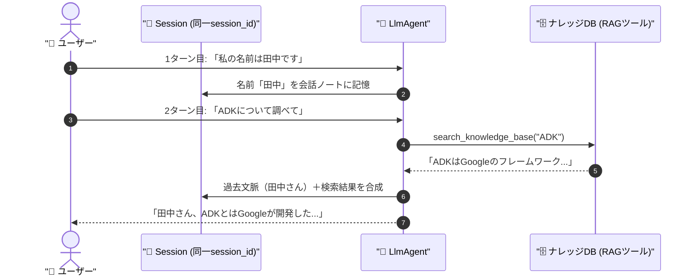

# 📘 第4章 ソースコード詳細解説

このドキュメントでは、第4章の完成版サンプルコード [`memory_agent_org.py`](file:///c:/AntiGravity/現場で役立つマルチエージェントAI設計入門_授業環境/chapter04/memory_agent_org.py) の仕組みと構成をわかりやすく解説します。

---

## 🎯 第4章の学習目的

1. 会話ループ全体で同一の **`session_id`** を保持し、AIに過去の発言を「記憶」させる仕組みを理解する。
2. 独自ナレッジデータベース（辞書）を構築し、AIの未学習な社内用語や最新知識を検索・回答に活かす **模擬RAG（Retrieval-Augmented Generation）** を体験する。

---

## 🏗️ 全体構造と処理の流れ



---

## 🔑 核心となるコードのパーツ解説

### 1. 模擬ナレッジベース（独自データベース）

```python
KNOWLEDGE_BASE = {
    "ADK": "ADK（Agent Development Kit）は、Googleが開発したエージェント構築フレームワークです。",
    "マルチエージェント": "複数の専門AIエージェントが協調して複雑なタスクを解決するシステムです。",
}

def search_knowledge_base(query: str) -> str:
    """社内ナレッジベースから関連情報を検索します。"""
    query_upper = query.upper()
    for key, value in KNOWLEDGE_BASE.items():
        if key in query_upper or query_upper in key:
            return f"【検索結果】 {key}: {value}"
    return "【検索結果】 該当する情報は見つかりませんでした。"
```

- LLMが知らない社内データやオリジナル用語を補う「RAGの検索部分」をPython関数で表現しています。

---

### 2. セッションの継続利用による「記憶」の実現

```python
# 会話ループの外側でセッションを一度だけ作成
session = runner.session_service.create_session_sync(
    app_name="memory_agent_app",
    user_id="student_001",
)

while True:
    user_input = input("あなた> ")
    # 毎ターン同じ session.id を渡して呼び出す
    for event in runner.run(
        user_id="student_001",
        session_id=session.id,  # ← 常に同じIDを使い回す
        new_message=...,
    ):
        ...
```

- **`session_id` を固定して会話を続ける**ことで、`runner.session_service` 内にユーザーとAIの過去の対話履歴が蓄積され、AIが「さっき何を言ったか」を覚えた状態で会話できます。

---

## 🚀 実行方法

ターミナルで以下のコマンドを実行します：

```powershell
cd chapter04
python memory_agent_org.py
```

### 試してみる対話フロー：
1. `私の好きな食べ物はラーメンです` と入力
2. `ADKって何ですか？` と入力（RAG検索が起動）
3. `私の好きな食べ物は何か覚えていますか？` と質問（過去記憶のテスト）

### 💡 演習ファイル（`memory_agent.py`）挑戦のヒント
- `memory_agent.py` では `search_knowledge_base` ツールのバインドや `session.id` の紐付けが穴埋めになっています！
