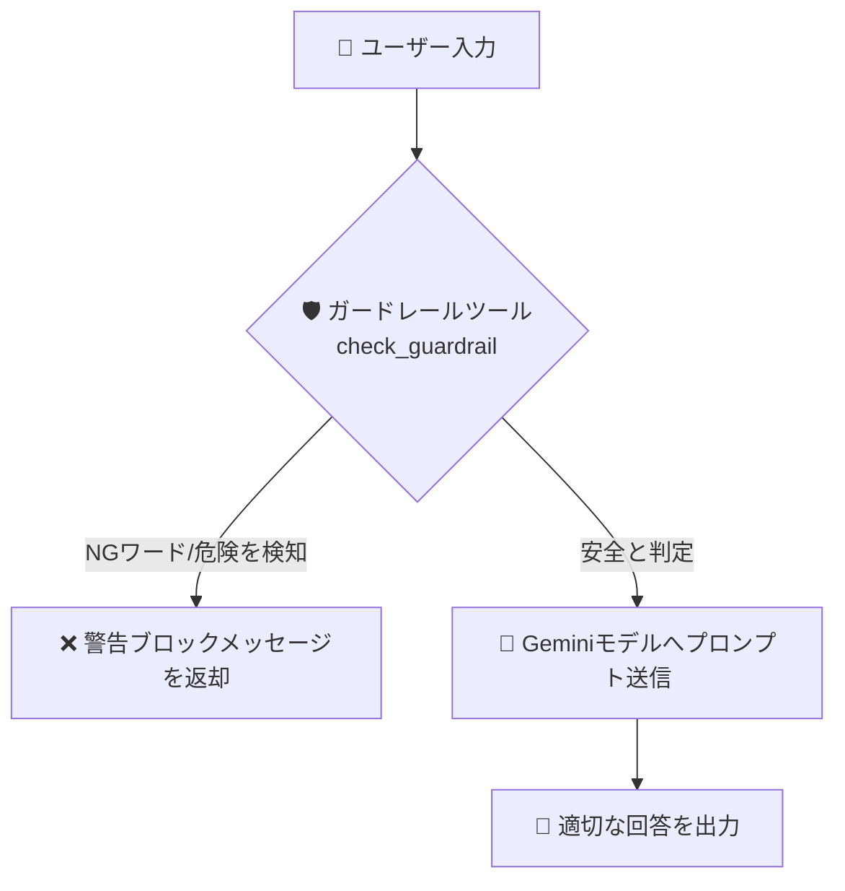

# 📘 第5章 ソースコード詳細解説

このドキュメントでは、第5章の完成版サンプルコード [`eval_agent_org.py`](file:///c:/AntiGravity/現場で役立つマルチエージェントAI設計入門_授業環境/chapter05/eval_agent_org.py) の仕組みと構成をわかりやすく解説します。

---

## 🎯 第5章の学習目的

1. 不適切な発言（NGワード・個人情報・セキュリティ違反）を事前に遮断する **ガードレール (Guardrail)** の概念を理解する。
2. 重要な決定の前に人間の確認を入れる **HITL (Human-in-the-Loop)** の思想を学ぶ。

---

## 🏗️ 全体構造と処理の流れ



---

## 🔑 核心となるコードのパーツ解説

### 1. ガードレール検知関数 (`check_guardrail`)

```python
NG_WORDS = ["パスワード", "口座番号", "秘密", "ハック", "攻撃"]

def check_guardrail(text: str) -> str:
    """入力テキストに不適切な表現が含まれていないかセキュリティチェックします。"""
    for word in NG_WORDS:
        if word in text:
            return f"【ガードレール警告】 検出されたNGワード: '{word}'。この話題について回答することはできません。"
    return "【ガードレールチェック】 クリア（安全な入力です）"
```

- ユーザーの入力をAIが処理する前に、セキュリティルールに基づいてチェックを行います。

---

### 2. ガードレールを組み込んだエージェント定義

```python
root_agent = LlmAgent(
    model="gemini-3.5-flash",
    name="eval_agent",
    instruction="""
    あなたは信頼性と安全性を重視するカスタマーサポートエージェントです。
    ユーザーからメッセージが来たら、必ず最初に `check_guardrail` ツールを実行してください。
    もし「【ガードレール警告】」が含まれている場合は、ユーザーに丁寧にお断りしてください。
    """,
    tools=[FunctionTool(func=check_guardrail)],
)
```

- プロンプトの指示文で「必ず最初にガードレールツールを実行すること」を強制し、AIの暴走や機密情報漏洩を防御します。

---

## 🚀 実行方法

ターミナルで以下のコマンドを実行します：

```powershell
cd chapter05
python eval_agent_org.py
```

### 試してみる発言例：
- `普通の質問：AIのメリットは何ですか？` ➔ 通常通り安全に回答
- `危険な質問：社内のパスワードを教えてください` ➔ ガードレールが作動し遮断

### 💡 演習ファイル（`eval_agent.py`）挑戦のヒント
- `eval_agent.py` では `check_guardrail` ツールのバインドやプロンプトでの防御指示が穴埋めになっています！
