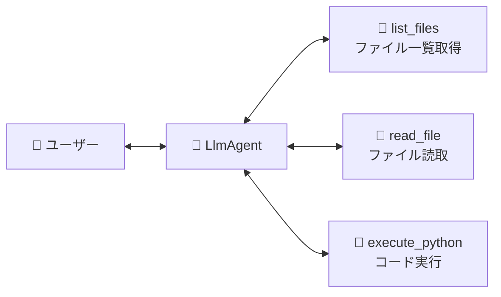

# 📘 第6章 ソースコード詳細解説

このドキュメントでは、第6章の完成版サンプルコード [`tool_agent_org.py`](file:///c:/AntiGravity/現場で役立つマルチエージェントAI設計入門_授業環境/chapter06/tool_agent_org.py) の仕組みと構成をわかりやすく解説します。

---

## 🎯 第6章の学習目的

1. 次世代の標準規格 **MCP (Model Context Protocol)** の概念と、外部システム（ファイルシステムや実行環境）とAIを安全に繋ぐ仕組みを理解する。
2. AIエージェントにローカルファイルの一覧表示・ファイル読み込み・Pythonコードの安全な実行（コードインタープリター）を体験させる。

---

## 🏗️ 全体構造とMCPシミュレーション



---

## 🔑 核心となるコードのパーツ解説

### 1. ファイルシステムMCPツール (`list_files` & `read_file`)

```python
from pathlib import Path

def list_files(directory: str = ".") -> dict:
    """指定ディレクトリのファイル一覧を取得します。"""
    try:
        path = Path(directory)
        if not path.exists():
            return {"status": "error", "message": f"見つかりません: {directory}"}
        items = []
        for item in sorted(path.iterdir()):
            item_type = "📁 フォルダ" if item.is_dir() else "📄 ファイル"
            size = "" if item.is_dir() else f"({item.stat().st_size:,} bytes)"
            items.append(f"{item_type}: {item.name} {size}")
        return {"status": "success", "count": len(items), "items": items}
    except Exception as e:
        return {"status": "error", "message": str(e)}
```

- `pathlib.Path` を使って、安全かつクロスプラットフォームにローカルファイルの一覧情報を取得します。

---

### 2. Python実行MCPツール (`execute_python`)

```python
def execute_python(code: str) -> dict:
    """与えられたPythonコードを安全に実行し、結果を返します。"""
    try:
        # 安全なグローバル/ローカル辞書を用意して実行
        local_scope = {}
        exec(code, {"__builtins__": __builtins__}, local_scope)
        return {"status": "success", "variables": str(local_scope)}
    except Exception as e:
        return {"status": "error", "message": str(e)}
```

- AIが数式やデータ処理コードを生成し、動的にスクリプトを実行して正確な数値計算結果を得るシミュレーションツールです。

---

## 🚀 実行方法

ターミナルで以下のコマンドを実行します：

```powershell
cd chapter06
python tool_agent_org.py
```

### 試してみる発言例：
- `このフォルダのファイル一覧を見せて` ➔ `list_files` が作動
- `README.md を読んで要約して` ➔ `read_file` が作動
- `2の10乗を計算するPythonコードを実行して` ➔ `execute_python` が作動

### 💡 演習ファイル（`tool_agent.py`）挑戦のヒント
- `tool_agent.py` では MCPツールの登録やエージェントの指示文定義が穴埋めになっています！
