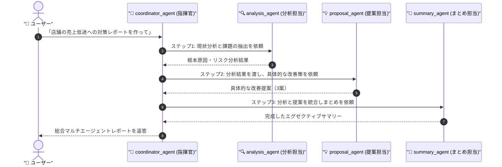

# 📘 第7章 ソースコード詳細解説

このドキュメントでは、第7章の完成版サンプルコード [`multi_agent_org.py`](file:///c:/AntiGravity/現場で役立つマルチエージェントAI設計入門_授業環境/chapter07/multi_agent_org.py) の仕組みと構成をわかりやすく解説します。

---

## 🎯 第7章の学習目的

1. 本書・本講座の最終ゴールである **A2A (Agent-to-Agent) マルチエージェントシステム** の全体像を理解する。
2. 役割の異なる3つの専門サブエージェント（分析・提案・まとめ）を総指揮官（コーディネーター）が自律制御・オーケストレーションする仕組みをマスターする。

---

## 🏗️ 全体構造とオーケストレーション



---

## 🔑 核心となるコードのパーツ解説

### 1. 3つの専門サブエージェントの定義

```python
# サブエージェント1：分析担当
analysis_agent = LlmAgent(
    model="gemini-3.5-flash",
    name="analysis_agent",
    description="現状やビジネス課題の根本原因とリスクを徹底的に分析する専門エージェント",
    ...
)

# サブエージェント2：提案担当
proposal_agent = LlmAgent(
    model="gemini-3.5-flash",
    name="proposal_agent",
    description="分析結果に基づいた具体的な解決策・改善案を提示する専門エージェント",
    ...
)

# サブエージェント3：まとめ担当
summary_agent = LlmAgent(
    model="gemini-3.5-flash",
    name="summary_agent",
    description="分析と提案を統合してエグゼクティブサマリーを作成する専門エージェント",
    ...
)
```

---

### 2. 総指揮官エージェント (Coordinator / Root Agent)

```python
root_agent = LlmAgent(
    model="gemini-3.5-flash",
    name="coordinator_agent",
    instruction="""
    あなたはマルチエージェントチームの指揮官です。
    ユーザーからテーマを受け取ったら、以下の手順でサブエージェントを動かしてください：
    1. analysis_agent に分析を依頼
    2. 分析結果を proposal_agent に渡し改善案を生成
    3. 全結果を summary_agent に渡し、経営陣向けサマリーを作成
    """,
    sub_agents=[analysis_agent, proposal_agent, summary_agent],
)
```

- **`sub_agents=[...]`**: 指揮官が動かせるエージェントチームを配列で渡します。指揮官はプロンプトのロードマップに従ってサブエージェントを順番に駆動させます。

---

## 🚀 実行方法

ターミナルで以下のコマンドを実行します：

```powershell
cd chapter07
python multi_agent_org.py
```

### 試してみる発言例：
- `「リモートワーク導入による生産性向上」についてマルチエージェントで検討して`

### 💡 演習ファイル（`multi_agent.py`）挑戦のヒント
- `multi_agent.py` では `root_agent` の `sub_agents` 設定やオーケストレーション指示が穴埋めになっています。全7章の集大成としてチャレンジしてみましょう！
